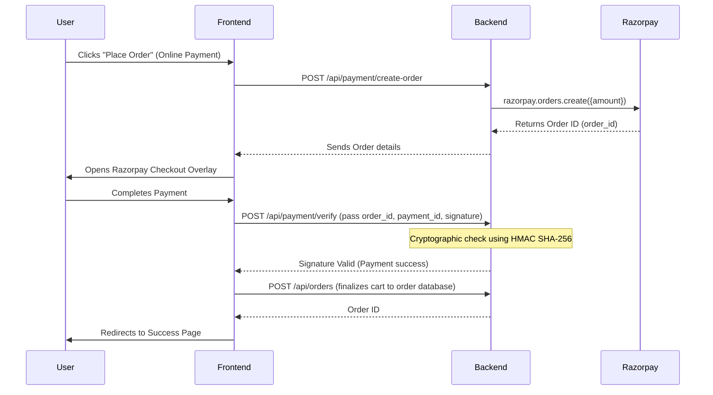

# 🎓 URBANTIQ Project Review & Interview Preparation Guide

This study guide is designed to help you ace your project review the day after tomorrow. It breaks down the architecture, explains the most complex logic (so you can explain it clearly), and lists potential questions the reviewer might ask.

---

## 📅 Hour-by-Hour Revision Plan (For Tomorrow)

| Time Slot | Topic | Focus Area |
| :--- | :--- | :--- |
| **09:00 AM - 10:30 AM** | **High-Level Architecture** | Understand how data flows from the HTML/JS frontend to Express routes, controllers, and MongoDB. |
| **10:30 AM - 12:00 PM** | **Authentication & Security** | Master the JWT token (httpOnly cookies) mechanism and how Google OAuth flows. |
| **12:00 PM - 01:30 PM** | **The Checkout & Razorpay Flow** | Trace the payment process: creating an order in Razorpay, client confirmation, signature validation, and database entry. |
| **02:30 PM - 04:00 PM** | **Advanced FIFO Inventory** | Study how `PurchaseItem` allocation works on checkout and rolls back on order cancellation. |
| **04:00 PM - 05:30 PM** | **Mock Interview Practice** | Review the **Q&A section** at the bottom of this guide. Practice explaining the logic out loud. |

---

## 🏛️ 1. Architecture & Folder Structure

URBANTIQ is built using the **MVC (Model-View-Controller)** pattern.
* **Frontend**: Vanilla HTML pages with custom CSS and vanilla JavaScript. Dynamic data is fetched using REST APIs (`fetch`).
* **Backend**: Node.js & Express.
* **Database**: MongoDB using Mongoose schemas.
* **State Management**: Session-less authentication using **JWT (JSON Web Tokens)** stored in secure cookies.

### Directory Mapping
```
urbantiq/
├── config/             # DB Connection (db.js) & Payment Client (razorpay.js)
├── models/             # Database Schemas (User, Product, Order, etc.)
├── controllers/        # Business Logic (Authentication, Orders, Cart, Wallet)
├── routes/             # Express API Endpoints matching Controllers
├── middleware/         # Auth Guards (authMiddleware.js, adminMiddleware.js)
└── public/             # Static Assets
    ├── views/          # HTML pages served (user & admin)
    └── js/             # Client-side scripts invoking APIs
```

---

## ⚙️ 2. Core Backend Flows (How the Logic Works)

If the reviewer asks you to explain the logic of a feature, use these step-by-step descriptions:

### Flow A: User Authentication & Security
1. **Traditional Signup**: When a user registers, the password is validated (minimum 8 chars, capitalization, numbers, and symbols) and hashed using **bcrypt** (10 salt rounds) before storing it in the database.
2. **OTP Verification**: An OTP is generated using `otp-generator`, stored on the User schema with a 5-minute expiration (`otpExpire`), and emailed via `nodemailer` (`utils/sendEmail.js`). Once verified, the user is activated (`isVerified: true`).
3. **Session Management (JWT)**: On successful login, the server signs a JWT containing the user's ID and sends it back in an **httpOnly cookie**:
   ```javascript
   res.cookie("token", token, { httpOnly: true, secure: false, sameSite: "lax" });
   ```
   * *Key Interview Point*: Storing tokens in `httpOnly` cookies makes them inaccessible to client-side scripts, protecting the user from **XSS (Cross-Site Scripting)** attacks.
4. **Google OAuth**:
   - The user clicks "Login with Google", redirecting them to Google's consent screen.
   - Google redirects back to `/api/auth/google/callback` with an authorization `code`.
   - The backend exchanges this `code` for Google credentials, fetches the profile, finds/creates a user record, and issues a standard local JWT cookie.

---

### Flow B: Order Placement & Razorpay Payment Integration
This is a secure **two-step payment verification** flow:

* *Key Interview Point*: Verification prevents **payment tampering** (e.g., a user modifying the payment amount in client-side code). By computing the HMAC signature on the server using your secret key, you guarantee that Razorpay authorized the payment.

---

### Flow C: Advanced FIFO Batch Stock Allocation
Unlike simple e-commerce apps that only decrease a general `stock` counter, URBANTIQ uses **FIFO (First-In-First-Out) batching**:
1. When a supplier batch is purchased, it is added to the database as a `Purchase` containing `PurchaseItems` marked as `LINKED` to variants with an initial quantity.
2. **Order Placement**:
   - The code queries `PurchaseItem` records where the variant matches and `remainingQuantity > 0`, sorted by `createdAt` in ascending order (Oldest batch first).
   - It deducts inventory starting from the oldest batch. If the oldest batch is fully consumed, it moves to the next oldest batch until the requested quantity is satisfied.
   - Finally, it updates the main Product variants' collective `stock` field.
3. **Order Cancellation**:
   - The code rolls back stock in reverse.
   - It updates the main Product variant stock.
   - It finds the batches linked to the product, sorted by `createdAt` in descending order (Newest batch first), and restores the `remainingQuantity` to restore the original batch counts.

---

### Flow D: Wallet & Returns / Refunds
1. Users have a `wallet` number field in the `User` schema (defaulting to `0`).
2. When placing an order, if they choose `paymentMethod: "Wallet"`, the backend validates that their balance is greater than or equal to `finalAmount`, deducts the balance directly, and logs a `DEBIT` `WalletTransaction`.
3. If an order is **cancelled** (if already paid) or a **return request is approved**, the code automatically refunds the order amount directly to their wallet and logs a `CREDIT` transaction log.

---

## 🙋 3. Anticipated Interview Questions & Best Answers

### Q1: "How do you secure your API endpoints so only logged-in users can access them?"
> **Answer**: "I implemented custom middleware called `authMiddleware.js`. This middleware extracts the JWT from the request cookies (`req.cookies.token`), verifies it using our `JWT_SECRET` key, and extracts the user's ID. If the token is valid, it attaches `req.userId = decoded.id` to the request object and calls `next()`. If it's missing or invalid, it returns a `401 Unauthorized` status, blocking the access."

### Q2: "How did you implement the review and rating logic? Can anyone review any product?"
> **Answer**: "No, review access is strictly validated. In `reviewController.js`, when a user posts a review, we first search their orders. We verify that:
> 1. An order exists containing that specific product variant.
> 2. The order belongs to the logged-in user.
> 3. The order status is `Delivered`.
> 4. The order item's `reviewed` flag is `false` (to prevent duplicate reviews for the same order).
> Once verified, the review is saved, the item is marked as `reviewed`, and we recalculate the product's average rating and review count."

### Q3: "What happens if two users try to buy the last remaining item at the exact same millisecond?"
> **Answer**: "Before checkout, the server performs a pre-flight validation check (`/api/orders/validate-stock`) which checks the exact inventory in real time. During order placement, the code performs database updates. To prevent issues, we check if the requested quantity exceeds the current stock inside the controller, and reduce the stock atomically. If stock drops below the required quantity, the process throws an error and rejects the order."

### Q4: "How does the system validate and apply coupon discounts?"
> **Answer**: "The coupon details (code, discount type, value, expiry date, usage limit, and used count) are stored in the database. When a coupon is applied:
> 1. We look up the active coupon and verify it is not expired.
> 2. We verify that `usedCount` has not exceeded the global `usageLimit`.
> 3. **(User Limit Check)**: We verify that the user has not already used this coupon code on a previous non-cancelled order by searching the `Order` database.
> If all checks pass, we calculate the discount (either flat rate or percentage based) and subtract it from the total. This same verification is run both at validation (`validateCoupon`) and right before placing the order (`placeOrder`) to prevent API tampering."

---

## 💡 Pro-Tips for the Review Session
* **Be Confident**: If you don't know the exact syntax of a library, focus on the **logic flow** (e.g., "I fetch the user, hash the input, compare, then sign a token..."). Interviewers care more about the architecture than memorized syntax.
* **Demonstrate code**: If they ask you to show code, open **`controllers/orderController.js`** to show the order placement and FIFO stock deduction logic, or **`controllers/walletController.js`** to show the Razorpay top-up flow. These show robust engineering practices.
* **Keep standard answers ready**: Use the answers from the Q&A section above to respond quickly and concisely.
